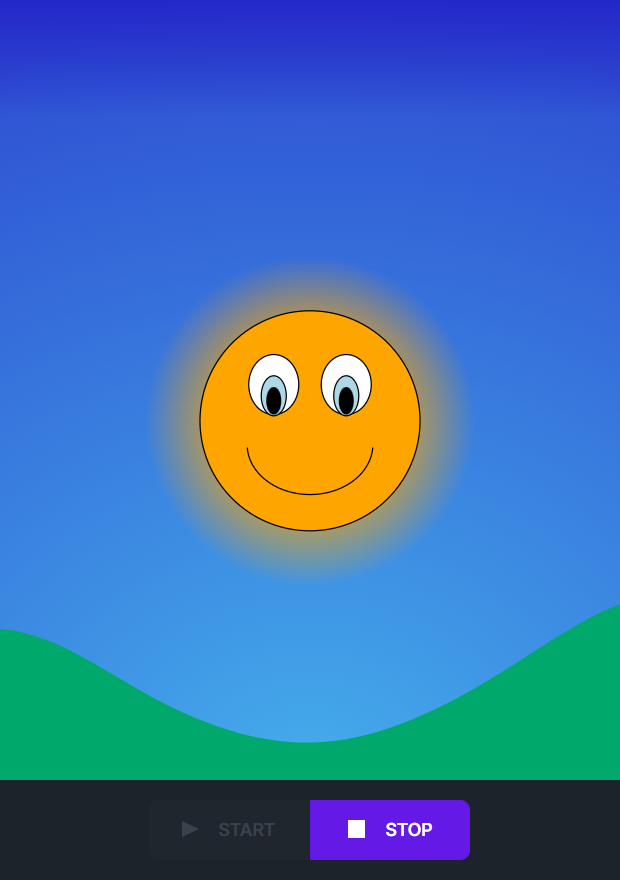

# Soundrise

**Description** SoundRise 2.0 is an application developed in React JS with the aid of Web Audio API, designed to help people with communication difficulties, especially children. The application provides an intuitive interface that allows the user to practise speech therapy voice exercises independently. The interface consists of a sun that symbolises the user’s voice and is animated according to the tonal and timbral characteristics of the voice itself: it analyses these vocal characteristics and displays a correspondent visual feedback in real time.

This application is the result of years of study and research by the CSC (Centro di Sonologia Computazionale). For years, the CSC has aimed to promote learning activities that encourage children, by considering physical actions as an integral part of cognition, through the use of technological enhancement.  
During these years, a number of prototypes have been developed and then shelved. The last update of Soundrise aims to develop an application maintainable over time, undertaking a reactivation process previously designed at CSC for the preservation and reactivation of artefacts.  
  
**Authors**: _Giada Zuccolo_; _Riccardo Fila_; _Stefano Giusto_; _Marco Randon_; _Gabriele Turetta_; _Alessandro Fiordelmondo_; _Antonio Rodà_; _Federico Avanzini_; _Sergio Canazza_; _Serena Zanolla_; _Raul Masu_

**Date Created** 2012  
**Last Update** 2023  

## Old Versions
| Year                       | Link                       | Img                       |
|:-------------------------------:|:-------------------------------:|:-------------------------------:|
| 2012 | [__Giusto__](./archive/past_versions/2012-Giusto/)  |  |
| 2012 | [__Randon__](./archive/past_versions/2012-Randon) |  |
| 2023 | [__Turetta__](./archive/past_versions/2023-Turetta) |  |

## Technical Notes

<!-- 
Technical Notes
 -->

### How soundrise works

**Flowchart - Audio feature extraction to graphical feedback** 
The application captures audio features from your voice using the device’s microphone and utilizes them to generate graphical feedback.

The audio features of your voice are mapped to the movement of a sun on the screen.

With the timber we consider only the five italian vowels

__link vowels-colors__  
[a] ⇒ rosso;  
[O] ⇒ arancione;   
[E] ⇒ verde;  
[i] ⇒ blu;  
[u] ⇒ grigio  

The vowels are extracted through an algorithm of Linear Predictive Coding (LPC) using defined vowel formants

## Video Demostration
<video controls src="archive/video/2023-soundrise2.0-demo.mp4" title="Title"></video>

[link to the video](archive/video/2023-soundrise2.0-demo.mp4)

### About repository
This repository serves as a tool for preserving the application and research project.  
The repository follows the guideline of the _Multilevel Dynamic Preservation_ (MDP) model ([https://www.frontiersin.org/articles/10.3389/frsip.2023.1183294/full](https://www.frontiersin.org/articles/10.3389/frsip.2023.1183294/full))  

