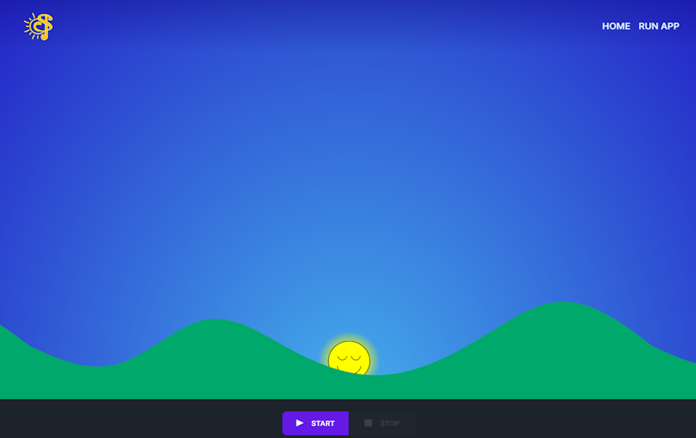

# Versions History

## 2023 - Giada Zuccolo (*latest version*)
|    |    |   |
|----|----|---|
| **Title** | Soundrise 2.0 | https://soundrise-82999.web.app/ |
| **person(s)** | Giada Zuccolo (developer, designer) Alessandro Fiordelmondo (supervisor), Sergio Canazza (supervisor) | [G.Zuccolo](https://www.dei.unipd.it/~zuccologia/) [A.Fiordelmondo](https:/github.com/alessandrofiordelmondo) [Sergio Canazza](https://www.dei.unipd.it/~canazza/)
| **Description** | A new Soundrise version completely redesigned for as a web application |
| **Photo** |  |
| | | |

##Component list
| **type** | **name** | **version** | **link** | **requirments** | **note** |
| web app | **soundrise2.0** | 1 | [link](archive/giada-soundrise2.0) | | Application developed in React / JavaScript |

##Bibliography
ZUCCOLO, GIADA. "A New Sunrise For Speech Therapy: Development of SoundRise 2.0 Application."

## 2023 - Gabriele Turetta

## 2012 - Marco Randon

## 2012 - Stefano Giusto

